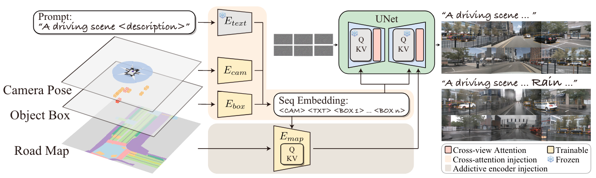
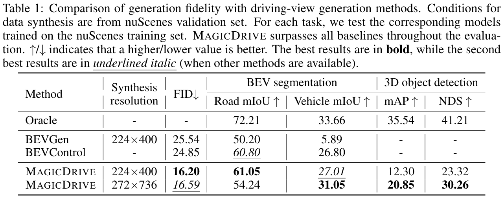
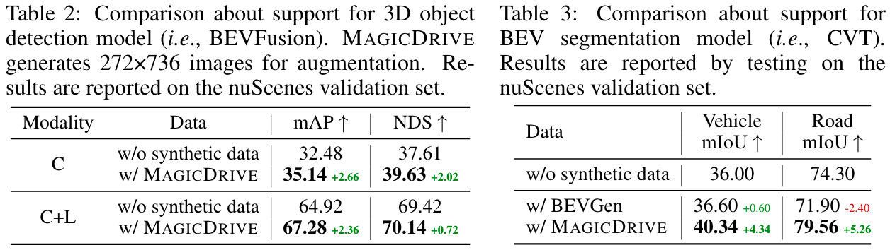
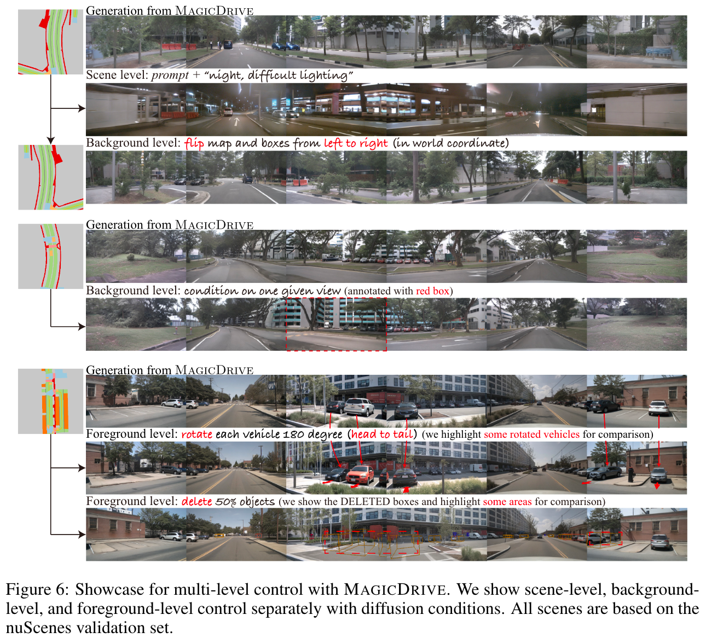

# MagicDrive

[](https://arxiv.org/abs/2310.02601) [](https://gaoruiyuan.com/magicdrive/)


This repository contains the implementation of the paper 

> MagicDrive: Street View Generation with Diverse 3D Geometry Control <br>
> [Ruiyuan Gao](https://gaoruiyuan.com/)<sup>1\*</sup>, [Kai Chen](https://kaichen1998.github.io/)<sup>2\*</sup>, [Enze Xie](https://xieenze.github.io/)<sup>3^</sup>, [Lanqing Hong](https://scholar.google.com.sg/citations?user=2p7x6OUAAAAJ&hl=en)<sup>3</sup>, [Zhenguo Li](https://scholar.google.com/citations?user=XboZC1AAAAAJ&hl=en)<sup>3</sup>, [Dit-Yan Yeung](https://sites.google.com/view/dyyeung)<sup>2</sup>, [Qiang Xu](https://cure-lab.github.io/)<sup>1^</sup><br>
> <sup>1</sup>CUHK <sup>2</sup>HKUST <sup>3</sup>Huawei Noah's Ark Lab <br>
> <sup>\*</sup>Equal Contribution <sup>^</sup>Corresponding Authors

Recent advancements in diffusion models have significantly enhanced the data synthesis with 2D control. Yet, precise 3D control in street view generation, crucial for 3D perception tasks, remains elusive. Specifically, utilizing Bird’s-Eye View (BEV) as the primary condition often leads to challenges in geometry control (e.g., height), affecting the representation of object shapes, occlusion patterns, and road surface elevations, all of which are essential to perception data synthesis, especially for 3D object detection tasks. In this paper, we introduce MAGICDRIVE, a novel street view generation framework offering diverse 3D geometry controls, including camera poses, road maps, and 3D bounding boxes, together with textual descriptions, achieved through tailored encoding strategies. Besides, our design incorporates a cross-view attention module, ensuring consistency across multiple camera views. With MAGICDRIVE, we achieve high-fidelity street-view synthesis that captures nuanced 3D geometry and various scene descriptions, enhancing tasks like BEV segmentation and 3D object detection.

## Method

In MagicDrive, we employ two strategies (cross-attention and additive encoder branch) to inject text prompt, camera pose, object boxes, and road maps as conditions for generation. We also propose cross-view attention module for multiview consistency.



## TODO

- [x] [config](configs/exp/224x400.yaml) and [pretrained weight](https://mycuhk-my.sharepoint.com/:u:/g/personal/1155157018_link_cuhk_edu_hk/ERiu-lbAvq5IkODTscFXYPUBpVYVDbwjHchDExBlPfeQ0w?e=8YaDM0) for base resolution (224x400)
- [x] demo for base resolution (224x400)
- [x] GUI for interactive bbox editing
- [ ] train and test code release
- [ ] config and pretrained weight for high resolution
- [ ] train and test code for CVT and BEVFusion

## Getting Started

### Environment Setup

Clone this repo with submodules

```bash
git clone --recursive https://github.com/cure-lab/MagicDrive.git
```

The code is tested with `Pytorch==1.10.2` and `cuda 10.2` on V100 servers. To setup the python environment, follow:

```bash
cd ${ROOT}
pip install -r requirements/dev.txt
# continue to install `third_party`s

# otherwise, to run GUI only
pip install -r requirements/gui.txt
# our GUI does not need mm-series packages.
# please also install diffusers from `third_party`.
```

We opt to install the source code for the following packages, with `cd ${FOLDER}; pip install .`

```bash
# install third-party
third_party/
├── bevfusion -> based on db75150
├── diffusers -> based on v0.17.1 (afcca39)
└── xformers  -> based on v0.0.19 (8bf59c9), optional
```

see [note about our xformers](doc/xformers.md). If you have issues with environment setup, please check [FAQ](doc/FAQ.md) first.

Setup default configuration for accelearte with
```bash
accelerate config
```

Our default log directory is `${ROOT}/magicdrive-log`. Please be prepared.

### Pretrained Weights

Our training are based on [stable-diffusion-v1-5](https://huggingface.co/runwayml/stable-diffusion-v1-5). We assume you put them at `${ROOT}/pretrained/` as follows:

```bash
{ROOT}/pretrained/stable-diffusion-v1-5/
├── text_encoder
├── tokenizer
├── unet
├── vae
└── ...
```

## Street-view Generation with MagicDrive

Download our pretrained weight for MagicDrive from [onedrive](https://mycuhk-my.sharepoint.com/:u:/g/personal/1155157018_link_cuhk_edu_hk/ERiu-lbAvq5IkODTscFXYPUBpVYVDbwjHchDExBlPfeQ0w?e=8YaDM0) and put it in `${ROOT}/pretrained/`

**Run our demo**

We recommand users to run our interactive GUI first, because we have minimize the dependencies for GUI demo.
```bash
cd ${ROOT}
python demo/interactive_gui.py
# a gradio-based gui, use your web browser
```

Run our demo for camera view generation.
```bash
cd ${ROOT}
python demo/run.py resume_from_checkpoint=magicdrive-log/SDv1.5mv-rawbox_2023-09-07_18-39_224x400
```
The generated images will be located in `magicdrive-log/test`. More information can be find in [demo doc](demo/readme.md).

## Train MagicDrive

Coming soon.

## Quantitative Results

Compare MagicDrive with other methods for generation quality:



Training support with images generated from MagicDrive:



More results can be found in the main paper.

## Qualitative Results

More results can be found in the main paper.



## Cite Us

```bibtex
@inproceedings{gao2023magicdrive,
  title={{MagicDrive}: Street View Generation with Diverse 3D Geometry Control},
  author={Gao, Ruiyuan and Chen, Kai and Xie, Enze and Hong, Lanqing and Li, Zhenguo and Yeung, Dit-Yan and Xu, Qiang},
  booktitle = {International Conference on Machine Learning},
  year={2024}
}
```

## Credit

We adopt following open-sourced projects:

- [bevfusion](https://github.com/mit-han-lab/bevfusion): dataloader to handle 3d bounding boxes and BEV map
- [diffusers](https://github.com/huggingface/diffusers): framework to train stable diffusion
- [xformers](https://github.com/facebookresearch/xformers): accelerator for attention mechanism
