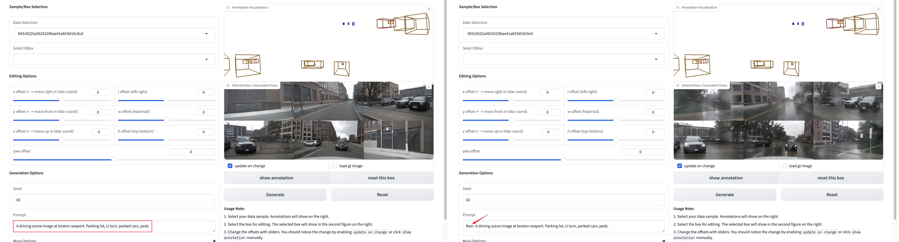
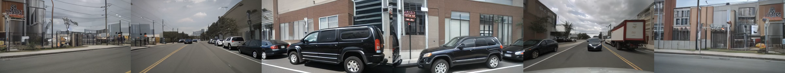
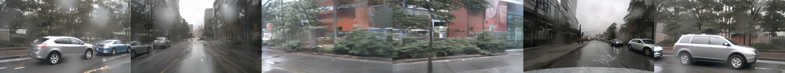

# MagicDrive

✨ If you want **video generation**, please find the code at the [`video branch`](https://github.com/cure-lab/MagicDrive/tree/video).

✨ Check out our new work [MagicDrive3D](https://github.com/flymin/MagicDrive3D) on **3D scene generation**!

[](https://arxiv.org/abs/2310.02601) [](https://gaoruiyuan.com/magicdrive/) [](https://github.com/cure-lab/MagicDrive/blob/main/LICENSE) [](https://github.com/cure-lab/MagicDrive)

This repository contains the implementation of the paper 

> MagicDrive: Street View Generation with Diverse 3D Geometry Control <br>
> [Ruiyuan Gao](https://gaoruiyuan.com/)<sup>1\*</sup>, [Kai Chen](https://kaichen1998.github.io/)<sup>2\*</sup>, [Enze Xie](https://xieenze.github.io/)<sup>3^</sup>, [Lanqing Hong](https://scholar.google.com.sg/citations?user=2p7x6OUAAAAJ&hl=en)<sup>3</sup>, [Zhenguo Li](https://scholar.google.com/citations?user=XboZC1AAAAAJ&hl=en)<sup>3</sup>, [Dit-Yan Yeung](https://sites.google.com/view/dyyeung)<sup>2</sup>, [Qiang Xu](https://cure-lab.github.io/)<sup>1^</sup><br>
> <sup>1</sup>CUHK <sup>2</sup>HKUST <sup>3</sup>Huawei Noah's Ark Lab <br>
> <sup>\*</sup>Equal Contribution <sup>^</sup>Corresponding Authors

## Abstract

Recent advancements in diffusion models have significantly enhanced the data synthesis with 2D control. Yet, precise 3D control in street view generation, crucial for 3D perception tasks, remains elusive. Specifically, utilizing Bird's-Eye View (BEV) as the primary condition often leads to challenges in geometry control (e.g., height), affecting the representation of object shapes, occlusion patterns, and road surface elevations, all of which are essential to perception data synthesis, especially for 3D object detection tasks. In this paper, we introduce MagicDrive, a novel street view generation framework, offering diverse 3D geometry controls including camera poses, road maps, and 3D bounding boxes, together with textual descriptions, achieved through tailored encoding strategies. Besides, our design incorporates a cross-view attention module, ensuring consistency across multiple camera views. With MagicDrive, we achieve high-fidelity street-view image & video synthesis that captures nuanced 3D geometry and various scene descriptions, enhancing tasks like BEV segmentation and 3D object detection.

## News

- [2024/06/07] MagicDrive can generate **60-frame** videos! We release the config: [rawbox_mv2.0t_0.4.3_60.yaml](https://github.com/cure-lab/MagicDrive/blob/video/configs/exp/rawbox_mv2.0t_0.4.3_60.yaml). Check out our demos on the [project page](https://gaoruiyuan.com/magicdrive/#long-video).
- [2024/06/07] We release **pre-trained weight** for **16-frame** video generation. [Check it out](https://github.com/cure-lab/MagicDrive/tree/video?tab=readme-ov-file#pretrained-magicdrive-t)!
- [2024/06/01] We holds the [W-CODA](https://coda-dataset.github.io/w-coda2024/index.html) workshop @ECCV2024. Challenge [track 2](https://coda-dataset.github.io/w-coda2024/track2/) will use MagicDrive as the baseline. We will release more resournce in the near future. Stay tuned!

## Method

In MagicDrive, we employ two strategies (cross-attention and additive encoder branch) to inject text prompt, camera pose, object boxes, and road maps as conditions for generation. We also propose cross-view attention module for multiview consistency.


## TODO

- [x] [config](configs/exp/224x400.yaml) and [pretrained weight](https://mycuhk-my.sharepoint.com/:u:/g/personal/1155157018_link_cuhk_edu_hk/ERiu-lbAvq5IkODTscFXYPUBpVYVDbwjHchDExBlPfeQ0w?e=8YaDM0) for base resolution (224x400)
- [x] demo for base resolution (224x400)
- [x] GUI for interactive bbox editing
- [x] train and test code release
- [ ] config and pretrained weight for high resolution
- [ ] train and test code for CVT and BEVFusion

## Getting Started

### Environment Setup

Clone this repo with submodules

```bash
git clone --recursive https://github.com/cure-lab/MagicDrive.git
```

The code is tested with `Pytorch==1.10.2` and `cuda 10.2` on V100 servers. To setup the python environment, follow:

```bash
# option1: to run GUI only
pip install -r requirements/gui.txt
# 😍 our GUI does not need mm-series packages.
# continue to install diffusers from `third_party`.

# option2: to run the full testing demo (and also test your env before training)
cd ${ROOT}
pip install -r requirements/dev.txt
# continue to install `third_party`s as following.
```

We opt to install the source code for the following packages, with `cd ${FOLDER}; pip -vvv install .`

```bash
# install third-party
third_party/
├── bevfusion -> based on db75150
├── diffusers -> based on v0.17.1 (afcca39)
└── xformers  -> based on v0.0.19 (8bf59c9), optional
```

see [note about our xformers](doc/xformers.md). If you have issues with the environment setup, please check [FAQ](doc/FAQ.md) first.

Setup default configuration for `accelerate` with
```bash
accelerate config
```

Our default log directory is `${ROOT}/magicdrive-log`. Please be prepared.

### Pretrained Weights

Our training is based on [stable-diffusion-v1-5](https://huggingface.co/runwayml/stable-diffusion-v1-5). We assume you put them at `${ROOT}/pretrained/` as follows:

```bash
{ROOT}/pretrained/stable-diffusion-v1-5/
├── text_encoder
├── tokenizer
├── unet
├── vae
└── ...
```

## Street-view Generation with MagicDrive

Download our pretrained weight for MagicDrive from [onedrive](https://mycuhk-my.sharepoint.com/:u:/g/personal/1155157018_link_cuhk_edu_hk/ERiu-lbAvq5IkODTscFXYPUBpVYVDbwjHchDExBlPfeQ0w?e=8YaDM0) and put it in `${ROOT}/pretrained/`

**Run our demo**

👍 We recommend users run our interactive GUI first, because we have minimized the dependencies for the GUI demo.
```bash
cd ${ROOT}
python demo/interactive_gui.py
# a gradio-based gui, use your web browser
```

As suggested by [#37](https://github.com/cure-lab/MagicDrive/issues/37), prompt is configurable through GUI!



Run our demo for camera view generation.

```bash
cd ${ROOT}
python demo/run.py resume_from_checkpoint=magicdrive-log/SDv1.5mv-rawbox_2023-09-07_18-39_224x400
```
The generated images will be located in `magicdrive-log/test`. More information can be find in [demo doc](demo/readme.md).

## Train MagicDrive

### Prepare Data
We prepare the nuScenes dataset similar to [bevfusion's instructions](https://github.com/mit-han-lab/bevfusion#data-preparation). Specifically,

1. Download the nuScenes dataset from the [website](https://www.nuscenes.org/nuscenes) and put them in `./data/`. You should have these files:
    ```bash
    data/nuscenes
    ├── maps
    ├── mini
    ├── samples
    ├── sweeps
    ├── v1.0-mini
    └── v1.0-trainval
    ```

> [!TIP]
> You can download the `.pkl` files from [OneDrive](https://mycuhk-my.sharepoint.com/personal/1155157018_link_cuhk_edu_hk/_layouts/15/onedrive.aspx?id=%2Fpersonal%2F1155157018%5Flink%5Fcuhk%5Fedu%5Fhk%2FDocuments%2FMagicDrive%2Fgithub%5Frelease%2Fnuscenes%5Fmmdet3d%5F2%2Etar%2Egz&parent=%2Fpersonal%2F1155157018%5Flink%5Fcuhk%5Fedu%5Fhk%2FDocuments%2FMagicDrive%2Fgithub%5Frelease&ga=1). They should be enough for training and testing.

2. Generate mmdet3d annotation files by:

    ```bash
    python tools/create_data.py nuscenes --root-path ./data/nuscenes \
      --out-dir ./data/nuscenes_mmdet3d_2 --extra-tag nuscenes
    ```
    You should have these files:
    ```bash
    data/nuscenes_mmdet3d_2
    ├── nuscenes_dbinfos_train.pkl (-> ${bevfusion-version}/nuscenes_dbinfos_train.pkl)
    ├── nuscenes_gt_database (-> ${bevfusion-version}/nuscenes_gt_database)
    ├── nuscenes_infos_train.pkl
    └── nuscenes_infos_val.pkl
    ```
    Note: As shown above, some files can be soft-linked with the original version from bevfusion. If some of the files is located in `data/nuscenes`, you can move them to `data/nuscenes_mmdet3d_2` manually.

3. (Optional) To accelerate data loading, we prepared cache files in h5 format for BEV maps. They can be generated through `tools/prepare_map_aux.py` with different configs in `configs/dataset`. For example:
    ```bash
    python tools/prepare_map_aux.py +process=train
    python tools/prepare_map_aux.py +process=val
    ```
    You will have files like `./val_tmp.h5` and `./train_tmp.h5`. You have to rename the cache files correctly after generating them. Our default is
    ```bash
    data/nuscenes_map_aux
    ├── train_26x200x200_map_aux_full.h5 (42G)
    └── val_26x200x200_map_aux_full.h5 (9G)
    ```

### Train the model

Launch training with (with 8xV100):
```bash
accelerate launch --mixed_precision fp16 --gpu_ids all --num_processes 8 tools/train.py \
  +exp=224x400 runner=8gpus
```
During training, you can check tensorboard for the log and intermediate results.

Besides, we provides debug config to test your environment and data loading process (with 2xV100):
```bash
accelerate launch --mixed_precision fp16 --gpu_ids all --num_processes 2 tools/train.py \
  +exp=224x400 runner=debug runner.validation_before_run=true
```

### Test the model
After training, you can test your model for driving view generation through:
```bash
python tools/test.py resume_from_checkpoint=${YOUR MODEL}
# take our pretrained model as an example
python tools/test.py resume_from_checkpoint=magicdrive-log/SDv1.5mv-rawbox_2023-09-07_18-39_224x400
```
Please find the results in `./magicdrive-log/test/`.

## Quantitative Results

Compare MagicDrive with other methods for generation quality:


Training support with images generated from MagicDrive:


More results can be found in the main paper.

## Qualitative Results

More results can be found in the main paper.


## Video Generation

🎉 Please find the code at the [`video branch`](https://github.com/cure-lab/MagicDrive/tree/video).

Videos generated by MagicDrive (click the image to see the video).

[](https://gaoruiyuan.com/magicdrive/static/videos/2_7_gen.mp4)

[](https://gaoruiyuan.com/magicdrive/static/videos/3_7_gen.mp4)

## Cite Us

```bibtex
@inproceedings{gao2023magicdrive,
  title={{MagicDrive}: Street View Generation with Diverse 3D Geometry Control},
  author={Gao, Ruiyuan and Chen, Kai and Xie, Enze and Hong, Lanqing and Li, Zhenguo and Yeung, Dit-Yan and Xu, Qiang},
  booktitle = {International Conference on Learning Representations},
  year={2024}
}
```

## Credit

We adopt the following open-sourced projects:

- [bevfusion](https://github.com/mit-han-lab/bevfusion): dataloader to handle 3d bounding boxes and BEV map
- [diffusers](https://github.com/huggingface/diffusers): framework to train stable diffusion
- [xformers](https://github.com/facebookresearch/xformers): accelerator for attention mechanism
- Thanks [@pixeli99](https://github.com/pixeli99) for training the [60-frame video generation](https://gaoruiyuan.com/magicdrive/#long-video).
